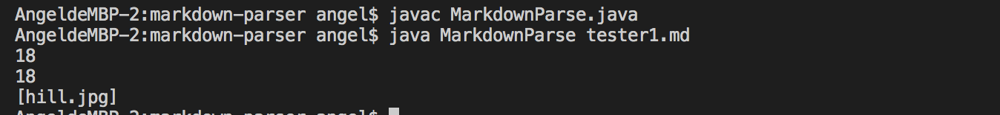
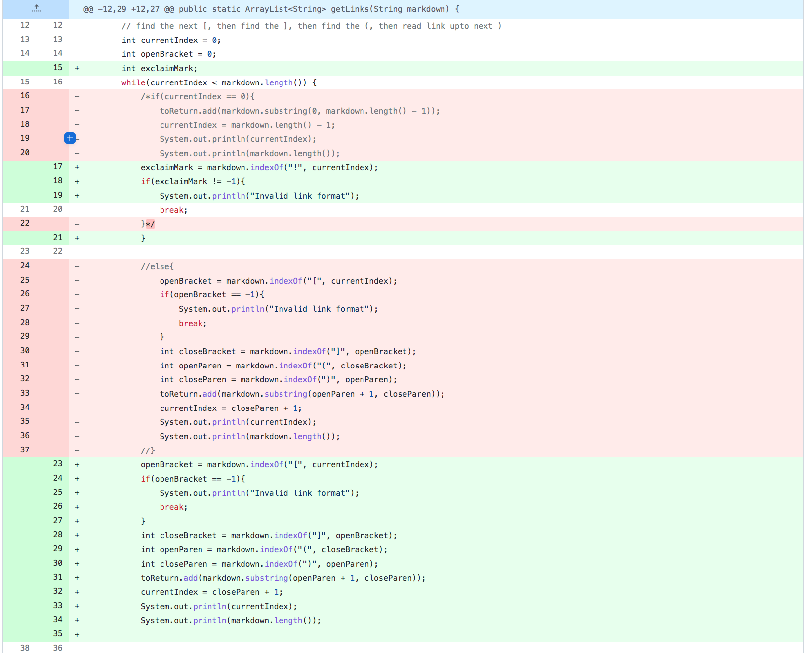
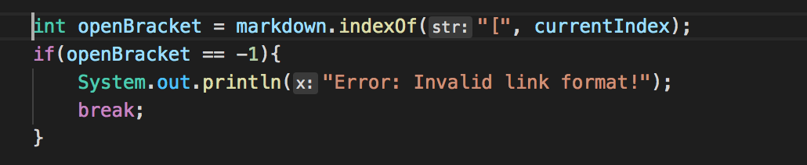
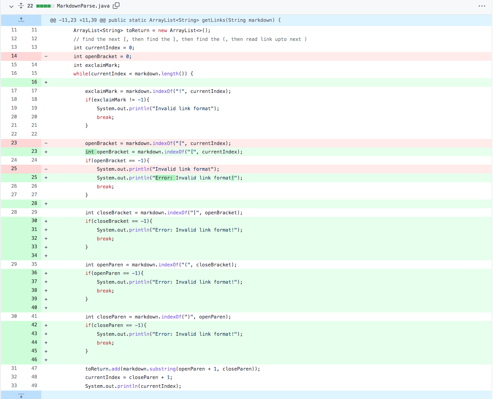
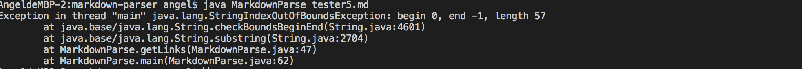
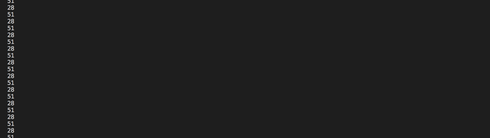

# _**Detecting and Fixing Bugs**_

In often times, as a programmer, we sometimes would assume our codes were completed solely based on the codes' successful compilation and being able to pass a very common,single test case. Nevertheless, **edge cases** (*cases that aren't really considered and tweaks between exception cases and normal cases*), are often not considered and they are potential threats to the complete functionality of a program and also may cause 

For instance, we have written a program of codes that help us to extract exact URL from a piece of URL written in Markdown format.

*Below are original lines of the code:*
```
import java.io.IOException;
import java.nio.file.Files;
import java.nio.file.Path;
import java.util.ArrayList;

public class MarkdownParse {

    public static ArrayList<String> getLinks(String markdown) {
        ArrayList<String> toReturn = new ArrayList<>();
        // find the next [, then find the ], then find the (, then read link upto next )
        int currentIndex = 0;
        while(currentIndex < markdown.length()) {
            int openBracket = markdown.indexOf("[", currentIndex);
            int closeBracket = markdown.indexOf("]", openBracket);
            int openParen = markdown.indexOf("(", closeBracket);
            int closeParen = markdown.indexOf(")", openParen);
            toReturn.add(markdown.substring(openParen + 1, closeParen));
            currentIndex = closeParen + 1;
        }

        return toReturn;
    }


    public static void main(String[] args) throws IOException {
        Path fileName = Path.of(args[0]);
        String content = Files.readString(fileName);
        ArrayList<String> links = getLinks(content);
	    System.out.println(links);
    }
}
```

Nevertheless, this only applies to tests that include the correct Markdown URL format. Thus edge cases such as incorrect URL format(*e.g. image link, missing brackets,etc.*) are not considered. Below are some of the edge cases, analysis of their symptoms and bugs, and how to fix them specifically. 

## **Edge Case #1**: Image in Markdown Format

* **Fixed Code**: 


This change was being made due to a tester that _**contains a image written in markdown format**_. Similar to the URL markdown format, they both have a pair middle brackets(*[ ]*), and a pair of parentheses followed afterwards(_**( )**_). Nevertheless, the image format has an exclaimation mark in front of the middle bracket:

[imageTester](https://github.com/Angelsofttoy/markdown-parser/commit/1ecc65669019dd79b5b21be89c6119f827dc83ab)

```

``` 

Thus, with a similar yet essentially non-applicable format, this is making it being an edge case. The program **should not** print what's within the parentheses, as it's not written strictly in the URL format. The code, if not successfully written, will likely to cause _**symptoms**_ of crashing terminal that throws an exception. 

* **Symptom**: The program produced the wrong output of image filename as URL, when it should prin out a corresponding error message. 

* **Terminal Output**: 


* **Bug**: The program _did not write_ a condition that handles this edge case.

* _**Analysis between Symptoms, Bugs, and Terminal Output:**_:
The symptom, which is shown in the terminal output, captured the image format(filename.jpg) into the list when it shouldn't.
This is because the involvement of exclaimation mark is not considered, as these few lines:
```
public class MarkdownParse {

    public static ArrayList<String> getLinks(String markdown) {
        ......
        while(currentIndex < markdown.length()) {
            int openBracket = markdown.indexOf("[", currentIndex);
            int closeBracket = markdown.indexOf("]", openBracket);
            int openParen = markdown.indexOf("(", closeBracket);
            int closeParen = markdown.indexOf(")", openParen);
            toReturn.add(markdown.substring(openParen + 1, closeParen));
            currentIndex = closeParen + 1;
        ......
}
```
...only cares if they have found the indexes of open/close bracket, and open/close parentheses to account it for an valid URL format. The image URL have all these elements thus making the program falsely consider it as a valid input, and produced the aforementioned symptom as shown in the terminal output, filename.jpg was captured. Nevertheless, as we have added these few lines within the while loop, the edge case is able to be successfully handled:


## **Edge Case #2**: Non-formatted URL

* **Fixed Code:**


The code was added with another if condition to handle null middle bracket is due to the tester file below. Despite it's indeed a valid URL, however it's not a valid *Markdown* formatted URL:

[badURLTester](https://github.com/Angelsofttoy/markdown-parser/blob/main/tester2.md)

```
https://docs.google.com/document/d/1MusPdu2aB27Avgn4HcfulWKXYCWYyslExS3XNQrzbjM/edit
```
Ideally, the program should be able to handle this edge case and print out a corresponding error message, instead of showing errors in the terminal below which shows this program _**has not taken this edge case into consideration**_ and its functionality is bugged. 

_**Symptoms, Bugs, and Terminal Output:**_

* Symptom: The program crashed and threw an out of bound exception. 

* Bug: The program did not write an if condition to handle this possible edge case.

* Terminal Output: 


* **Analysis:**
This symptom was shown is because as below lines of the program searched for middle brackets, since there are none so the index of "[", openBracket will be equal to the value of -1, thus leading to an out of bounds exception being thrown at the terminal output. This problem can be fixed by adding another if condition in the program codes as shown below. 

```
    ......
    //original lines of codes:
            int openBracket = markdown.indexOf("[", currentIndex);
           
    ......
}
```
**Fixed Codes**: 


## **Edge Case #3**: Partially Formatted URL

* **Fixed Code ScreenShot:**


These if conditions were added due to tester files below that include URL which are only formatted correct partially, as they are either partially or compeletely missing middle brackets/parentheses:

[noParenTester](https://github.com/Angelsofttoy/markdown-parser/blob/main/tester5.md)
```
link1(https://something.com)
link2(some-thing.html)
```

[noMiddleTester](https://github.com/Angelsofttoy/markdown-parser/blob/main/tester6.md)
```
[link1]https://something.com,[link1]https://something.com
```
If handled correctly, the program should neither have symptoms of throwing an exception in the terminal or capturing these two URL into the list. 

_**Symptoms, Bugs, and Terminal Output:**_

* Symptom: The program crashed and threw an out of bounds exception, *again*! :(

* Bug: Did not properly consider/write all if conditions for the possiblity of other brackets/parentheses' idx are at -1. 

* Terminal Output:
    1. No brackets: 
    2. No parentheses: 

* Analysis: The first output, similarly, as the second edge case was easy to fix as it also threw an out of bounds exception. So all it needed is addition of another if condition. The second output, despite it entered an infinite loop, which is due to the following line of code. 
```
toReturn.add(markdown.substring(openParen + 1, closeParen));
```
* As the openParen is equals to [-1(oepnParen idx) + 1 = 0], while then closeParen equals to -1, the code will repeatedly go through the tester file and trying to find the the char located at -1, which apparently, it doesn't exist, thus entering a loop. As complexing as the situation may seem, the problem could also be fixed by adding two if conditions to handle if *openParen* and *closeParen* ' indexes are at -1, like below: 
