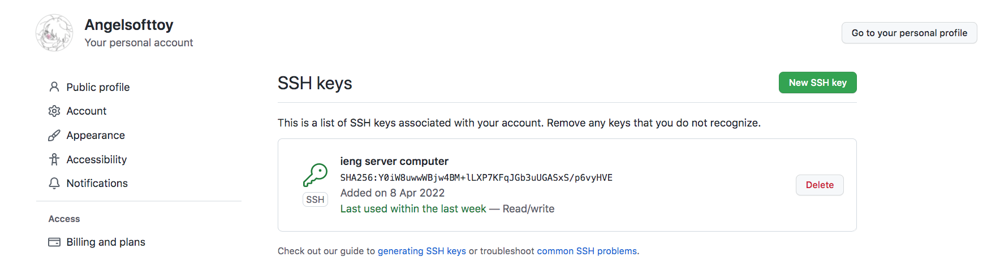
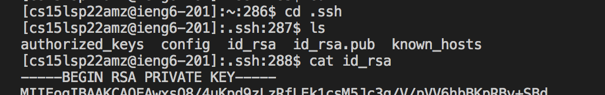
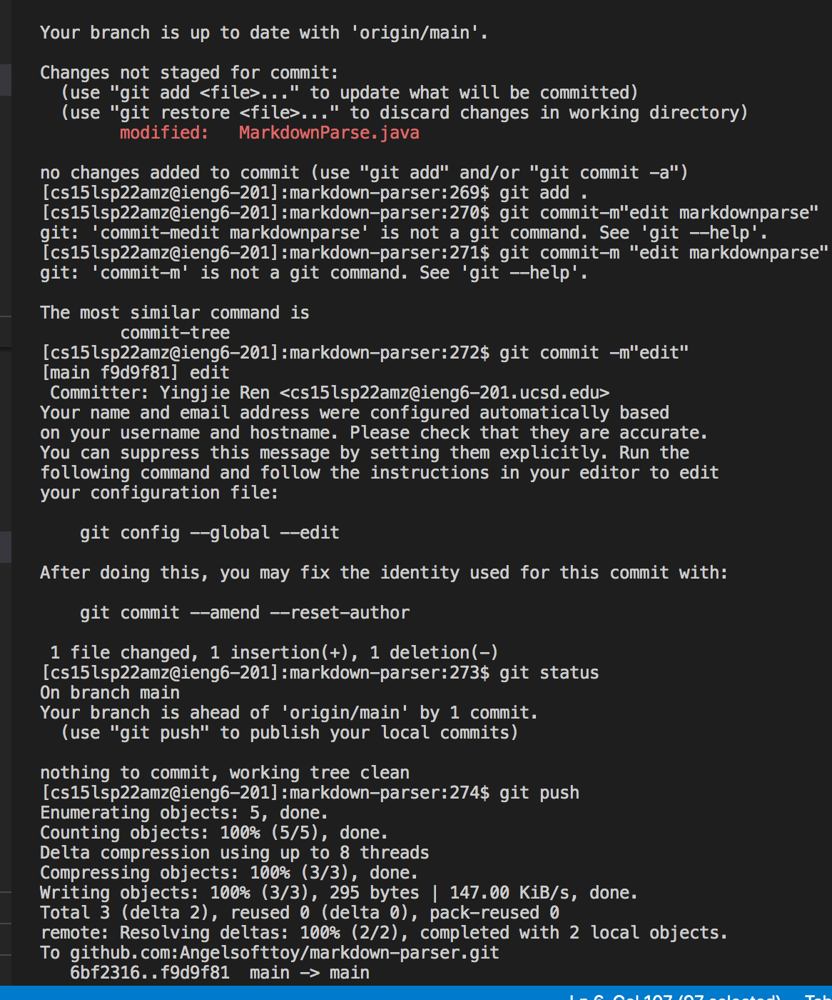
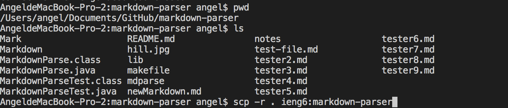
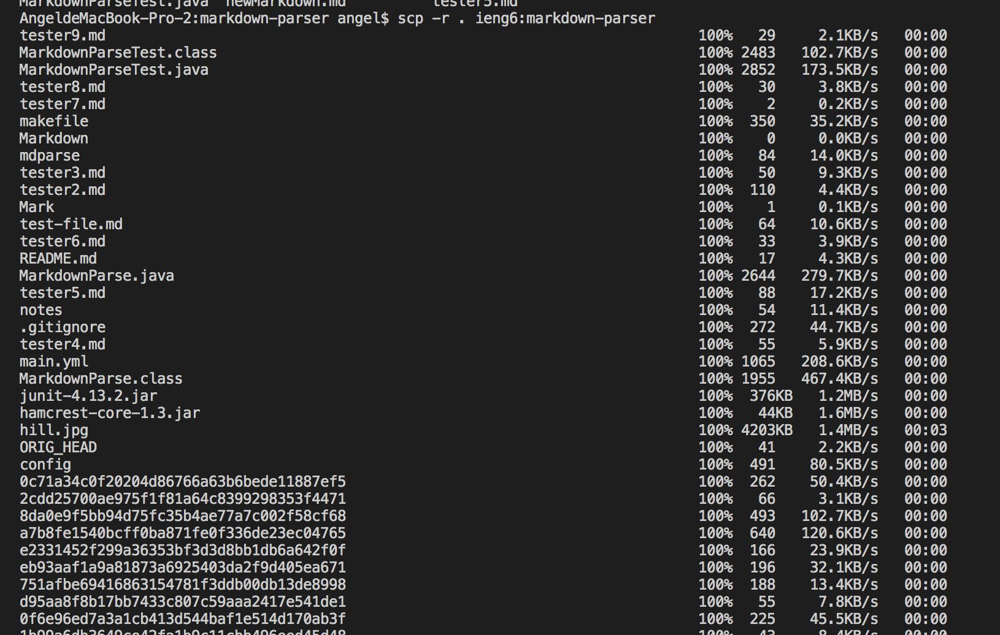
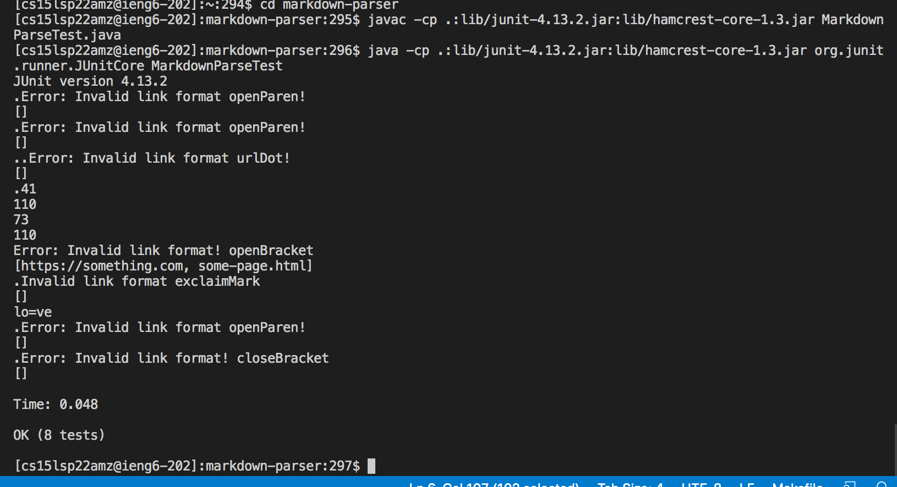
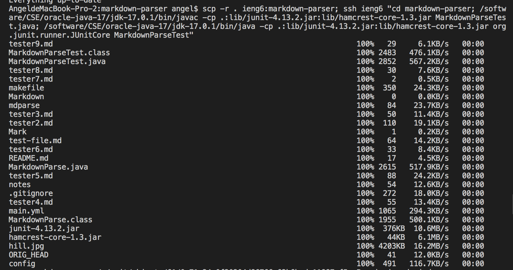
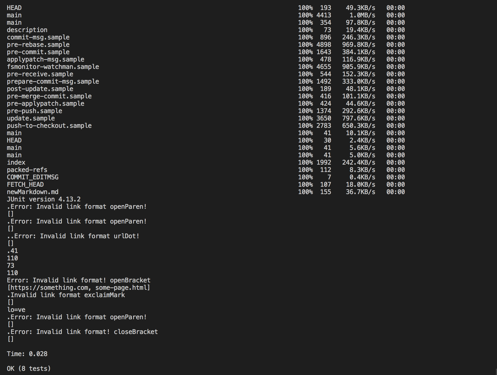

# _**Faster Runner**_

## **2. Setup Github Access from ieng6**

Below is the SSH keys I've stored in the github setting:



The private key is stored within the ssh directory on the remote ieng6 server in id_rsa file:



Following this, I used several commands in the terminal to remotely delete a line in the java file MarkdownParse.java and pushed it to the github server as shown in the picture below.



Below is the link that stored relevant data about this commit with the message "edit":

[! link to github-commit !](https://github.com/Angelsofttoy/markdown-parser/commit/f9d9f81a540ead9d9e8efc3b98e03db8eb129900)

## **3. Copy whole directories with scp -r**
For copying the whole markdown directory to one's ieng6 account, we simply need to put this command in the terminal:

```
$ scp -r . ieng6:markdown-parser 
```
And as we could see below the file listed within this directory are all being copied into my ieng6 account. 




It's pretty easy to run this in our ieng6 account after we have copied this markdown-paraser repository: 



As we could see, all of the test are sucessfully being ran on ieng6 server. 
 
Nevertheless there is a simpler one-line command that could combine these two previous steps together, finishing the copying and running process at at once:

```
$ scp -r . ieng6:markdown-parser; ssh ieng6 "cd markdown-parser; javac -cp .:lib/junit-4.13.2.jar:lib/hamcrest-core-1.3.jar MarkdownParseTest.java; java -cp .:lib/junit-4.13.2.jar:lib/hamcrest-core-1.3.jar org.junit.runner.JUnitCore MarkdownParseTest"
```



This one-line command after doing scp and ssh command to copy and logging into the account, put the change directory and compile/run commnands all in quotes in order to run it all in one-line. 
