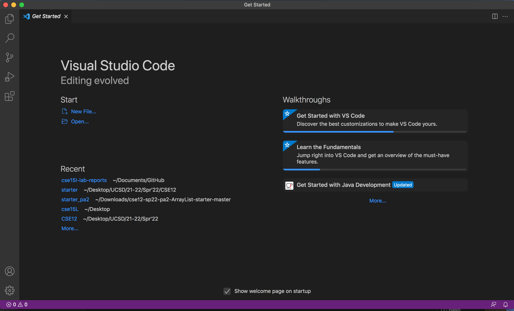
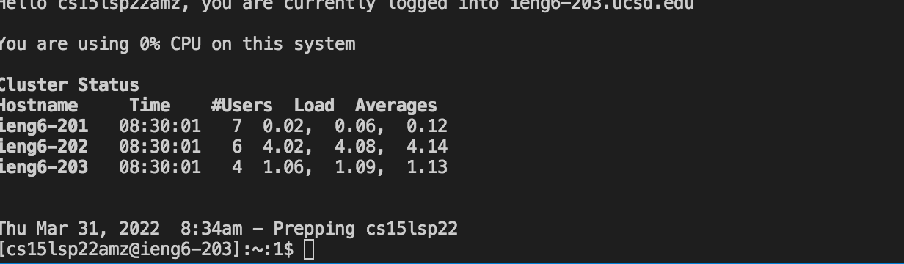
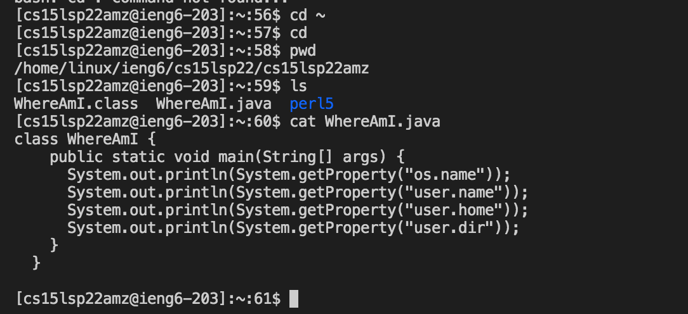
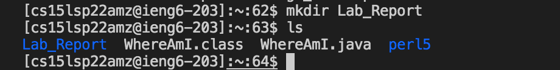
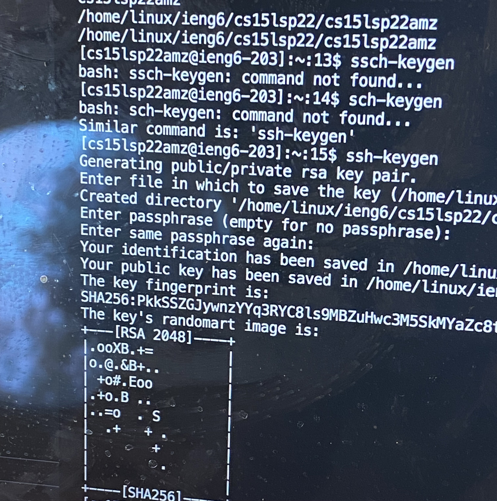
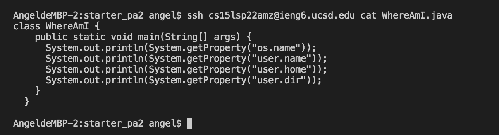

# _**A Tutorial for Logging into a Remote Computer(ieng6)!**_

Hii!! Future CSE15L students! (including future myself who may forget some of the course content) 

This blog post is made for *you* ! To get to know how to:

    1. Remotely log into a lab computer at school.
    2. Access its repositories and file datas within it.
    3. Modify file datas on remote repositories.

You might be worried that it's a bit complicated, but no worries! This blog post is herr to guide you through it :) ! We will make it _**together**_ !

## 1. Installing Visual Studio Code

*Visual Studio Code* is a really great coding program that is capable of supporting various coding languages from Java to C++, etc. 

Most importantly, it has an easy-to-operate, easy-to-understand terminal, which will be our main resort in logging into a remote computer. 

_**But first, we need to install it!**_

Let's go to Visual Studio Code's Official Link for [downloading the software](https://code.visualstudio.com/), and finish the installing process. 

Depnding on your computer's operating system(Linux/Window/Mac), you should download corresponding Visual Studio Code version onto your computer. 

After you are finished with downloading it and setting up, its homepage should look something like this:

Congrats! You have finished the first step! *_*coffetti*_* ! Where are my *_*coffettis*_*! 

## 2. Connect to Your own Remote Computer

Before we put any cool commands in Visual Studio code's terminal, you need to first know your CSE15L account, click on [UCSD's educaitional technology service website](https://sdacs.ucsd.edu/~icc/index.php), so you could do some account look up:).

Once you know what is your account name specifically, we could now begin the remotely connecting process! Yay!!

**_Firstly_**, let's open the terminal on your visual studio code by click on Terminal --> New Terminal on the menu tab. 

Then, afterh the $ sign in terminal, you need to input your CSE15L account name, which should be the below format(the bolded part should be your account specfic name):

* $ cs15lsp22 **_zz_** @ieng6.ucsd.edu

After pressing return, as it's your first time of logging into this remote computer, you will probably get a warning message, that asks you something like, *whether you are sure of connecting to this computer? (yes/no/[fingerprint])*

After seeing this appeared in the terminal, do not panic! Just type yes and press return. Then you should be able to see it's prompting you to enter the password too. 

Enter your account password, **also**, do not **_panic_** if you can't see the password you entered in the terminal. Your input is being recorded, it's just won't show visually. Press return after you finished entering the password. 

Then you should able to see this ! :

Congrats! This means you have successfully logged onto a remote computer at the lab! Isn't this exciting *:D* ?

## 3. Trying Some Commands

Having logged onto the computer, now we could try all different kinds of commands that could help us to access, modify, and even move files from our own computer to the CSE Lab computer!

1. If you want to access datas in a specfic directory:

* $ cd for changing to a new directory(but for now we are just going to 
stick with this current directory).

* $ pwd for showing the directory you currently are in. 

* $ ls for listing all file datas' names in the current directory. 

* $ cat *filename*.java for accessing content within a specifc file

2. If you want to create a new folder, just type:

* $ mkdir **_your folder name_**

    *Then enter:*

* ls (*meaning: list*)

    And you should be able to see the new folder created in the computer:

If you wish to try more command on your own, here's an useful website 

## 4. Move Files with SCP

Great! Now we have got to know some of the basic ssh-based commands that could remotely interlink them with files on a lab computer, we could turn toward a even cooler thing -- **_transfering files from our computer to the lab computer_** ! 

It's simple, we just need to type some commands on the terminal *again* !

## 5. Setting a SSH key

Setting a SSH key could save us from repeatedly entering a password to log into the remote computer. Instead, we could simply enter(the intalized/bolded part is your own username):

* $ ssh cs15lsp22**_zz_**@ieng6.ucsd.edu

And we could actually log into the remote computer without entering any password! Below I will show how we could get this set up. 

This is similar to each time you enter a passowrd on a website through google chrome, it will asks you if you want to save this password. Similarly, through the following steps, will be also helping you to save your password and thus you don't have to enter it:                          

1. enter ssh-keygen command on your terminal

    *  $ ssh-keygen

2. then, the terminal will display some message, and the last one will be:

    * Enter paraphrase (empty for no paraphrase) :

    At this point, you just need to press return and don't need to enter anything. 

3. Then you should be able to see it shows some similar messages in your terminal:

* 

## 6. Optimizing Remote Running

Even after you have saved the trouble of contiously entering password in order to log in, sometimes it just takes way too long to enter all sorts of commands too. *LUCKILY*, there are some short cuts for it! ;)

* type multiple commands on the same line:

    * e.g. *ssh cs15lsp22amz@ieng6.ucsd.edu* + *cat WhereAmI.java* are inputed into the same line. And it directly shows the file content.

    

* pre-type some of commands that you will be using frequently in the terminal:

    * then, use the *up arrow* key on your keyboard, so some of your frequent commands could appear as you tapping on the up arrow key. So it could minimize times spent on typing command lines.

Yay! I believe we have reached the end of this little tutorial! It may not be much, but I hope it could be of some help to you!

**_Congrats :) !_**
