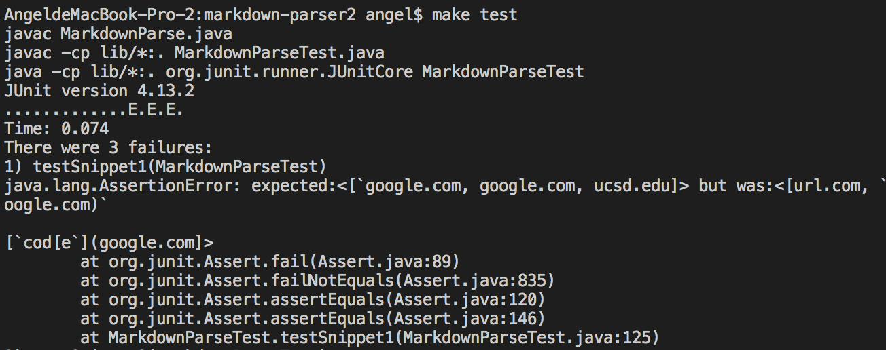

# _**Lab Report4: Testing Markdown Snippets**_

## **Links to Repos**

[linkToMyMarkdown](https://github.com/Angelsofttoy/cse15l-lab-reports)

[linkToReviewedMarkdown](https://github.com/thanhnhanlam/markdown-parser)

## **1.Snippet 1**
**snippet content:**
***
 ```
[a link](url.com)

[another link](`google.com)`

[`cod[e`](google.com)

[`code]`](ucsd.edu)
 ```
***
- **_expected list of valid links:_**
```
"`google.com","google.com","ucsd.edu"
```

- **_test format:_**
```
@Test
    public void testSnippet1() throws IOException{
        Path fileName = Path.of("snippet1.md");
        String content = Files.readString(fileName);
        ArrayList<String> links = getLinks(content);
        System.out.println(links);
        assertEquals(List.of("`google.com","google.com","ucsd.edu"), links);
    }
```


The result of how my actual tester output list of links turned out is shown as below:


- **_Actual Result:_**
```
[url.com, `google.com, google.com]
```

Result of reviewed test output:



- **_Actual Result:_**
```
[ url.com, `oogle.com, [`code[e`](google.com ]
```

- **_Reflection:_** In this case the tester case is not passed, because the pair of backticks formats "[a link" as `[a link`(an inline code), before the link markdown format, so url.com should not be in the expected list, while my MarkdownParse.java did not consider backticks, or to say I merely consider the test cases for having an exclaimation mark before the middle bracket. 

> Do you think there is a small (<10 lines) code change that will make your program work for snippet 1 and all related cases that use inline code with backticks? If yes, describe the code change. If not, describe why it would be a more involved change.

A: I do think implementing some simple code changes would be able to fix this, like including an if condition such as:

 ```
    if((backtick >= closeParen + 1  || backtick <= openBracket - 1) ){
        if(but only appeared ater closeParen ||but only appeared before openBracket){
            continue;
        }
        else if(backtick is inbetween brackets indices/inbetween parenthesis indices){
            return;
        }
        else if(backtick is inbetween closeBracket and openParen){
            return;
        }
    }
   
    getLink(filename.fileExtension)
    
```
By these codes I think it can handle most of the conditions where backticks are included and cases that different placement of backticks would produce different results. If only the backtick only appeared after or before the openBracket or closeParen but not at both ends, the method would continue to the getLink method, but if appeared at spaces that would lead to an inline code or invalid url format, the method would just return. 

## **2.Snippet 2**
**snippet content:**
***
 ```
[a [nested link](a.com)](b.com)

[a nested parenthesized url](a.com(()))

[some escaped \[ brackets \]](example.com)
 ```
***
- **_expected list of valid links:_**
```
["a.com","a.com(())","example.com"]
```

- **_test format:_**
```
@Test
    public void testSnippet2() throws IOException{
        Path fileName = Path.of("snippet2.md");
        String content = Files.readString(fileName);
        ArrayList<String> links = getLinks(content);
        System.out.println(links);
        assertEquals(List.of("a.com", "a.com(())", "example.com"), links);
    }
```


The result of how my actual tester output list of links turned out is shown as below:


- _Actual Result:_
```
    [a.com, a.com((]
```

Result of reviewed test output:


- _Actual Result:_
```
    [a.com, b.com, a.com(())]
```


- **_Reflection:_** In this case the tester case is not passed, we did not consider the case of multiple pairs of parenthesis/bracket within the outmost paren and bracket. In addition we both didn't consider the case where backslash is used, which it's an escape character to escape characters that have special meanings, such as the repeated middle bracket at the third line: 

```
[some escaped \[ brackets \]](example.com)
```
And that's why example.com was able to be counted in as a valid URL link. 

> Do you think there is a small (<10 lines) code change that will make your program work for snippet 2 and all related cases that nest parentheses, brackets, and escaped brackets? If yes, describe the code change. If not, describe why it would be a more involved change.

A: For this I personally think it's actually not that simple and it could not be fixed by a small code change. Because there are two major cases involved:

* if condition for whether brackets are paired or single/same applies to parenthesis:
    * if they are paired, are they also in pair with paired brackets/paranthesis?
        * if not, are they escape brackets? 

* if they are not paired, are they placed in a position where it would not hinder the existing URL markdown format?

Since the condition turned out to be much more complicate(maybe I'm overthinking it a little bit), but for now it seems that it require a much thourough consideration regarding how to implement the code changes. So I don't think it could be fixed by less than 10 lines. 

## **3.Snippet 3**
**snippet content:**

***
 ```
[this title text is really long and takes up more than 
one line

and has some line breaks](
    https://www.twitter.com
)

[this title text is really long and takes up more than 
one line](
https://sites.google.com/eng.ucsd.edu/cse-15l-spring-2022/schedule
)


[this link doesn't have a closing parenthesis](github.com

And there's still some more text after that.

[this link doesn't have a closing parenthesis for a while](https://cse.ucsd.edu/


)

And then there's more text
 ```
***

Although there are three blue highlights in the snippet 3 above, but the only valid one is this part:

 ```
 [this title text is really long and takes up more than 
one line](
https://sites.google.com/eng.ucsd.edu/cse-15l-spring-2022/schedule
)
 ```

- **_expected list of valid links:_**
```
[https://sites.google.com/eng.ucsd.edu/cse-15l-spring-2022/schedule]
```

- **_test format:_**
```
@Test
    public void testSnippet2() throws IOException{
        Path fileName = Path.of("snippet2.md");
        String content = Files.readString(fileName);
        ArrayList<String> links = getLinks(content);
        System.out.println(links);
        assertEquals(List.of("a.com", "a.com(())", "example.com"), links);
    }
```


The result of how my actual tester output list of links turned out is shown as below:


- _Actual Result:_
```
    [https://www.twitter.com
)

[this title text is really long and takes up more than 
one line](
https://sites.google.com/eng.ucsd.edu/cse-15l-spring-2022/schedule
)


[this link doesn't have a closing parenthesis](github.com

And there's still some more text after that.

[this link doesn't have a closing parenthesis for a while](https://cse.ucsd.edu/

]
```

Result of reviewed test output:


- _Actual Result:_

```
    [https://www.twitter.com
)

[this title text is really long and takes up more than 
one line](
https://sites.google.com/eng.ucsd.edu/cse-15l-spring-2022/schedule
)


[this link doesn't have a closing parenthesis](github.com

And there's still some more text after that.

[this link doesn't have a closing parenthesis for a while](https://cse.ucsd.edu/

]

```

- **_Reflection:_** The result was exceedingly and unnecessarily long because the case of having blanks spaces and multiple line breaks(which also constitued as blanks spaces are not considered, thus not being to handle the invalid cases a closeParen seperated by tabs and blank lines lead to a very long result.)

> Do you think there is a small (<10 lines) code change that will make your program work for snippet 3 and all related cases that have newlines in brackets and parentheses? If yes, describe the code change. If not, describe why it would be a more involved change.

A: For this I think it could actually be fixed by simple edits. We would just need to take account of URL having their closing parethesis directly after the returned new line as valid and other as invalid to take care of this problem. A single if/else condition should be sufficient. 