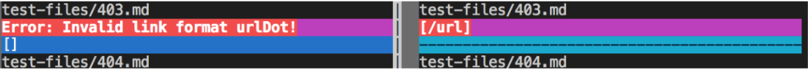

# _**Tests Comparision**_

1. **How you found the tests with different results (Did you use vimdiff on the results of running a bash for loop? Did you search through manually? Did you use some other programmatic idea?)**

A: I found the tests with different results by using vimdiff command, which shows the test results of each test side by side in the terminal. I used this specific command below:
```
$ vimdiff my-markdown-parser/results.txt cse15lsp22-markdown-parser/results.txt
```
Then I just scrolled down to find any reuslt discrepencies and took screenshots. 

***

**Link to tests' content:**

[test 403's content](https://github.com/Angelsofttoy/markdown-parser/blob/main/test-files/403.md?plain=1)


[test 516's content](https://github.com/Angelsofttoy/markdown-parser/blob/main/test-files/516.md?plain=1)

***

## **1. test 403**

For this one, the implementation of the TA's markdownParse.java is the correct implemetntaion. Because as I put it in VS code to see if the text portion within the middle brakcet is highlighted, it is indeed highlighted as shown by the picture below:


**In summary:**

* Expected Output:
```
[/url]
```
* Actual Output(of my implementaion):
```
[]
```
* Actual Output(of TAs' implementation):
```
[/url]
```

So in this case my implementation was wrong, as the codes identified the text as an invalid URL markdown format, while the passed in text indeed contains valid URL format. 

**Analysis for incorrect implementation:** 

A: For this test, my implementaion had the incorrect list of URL as the result, which is an empty middle bracket when it should contain the aforementioned URL link. I think this is due to this segment of my code:
```
```

***


*foo [bar](/url)*