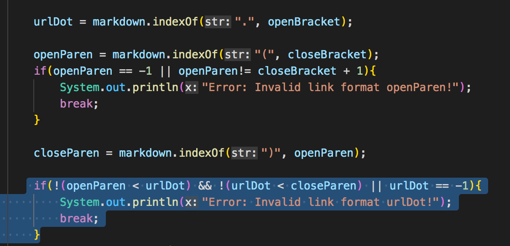

# _**Tests Comparision**_

1. **How you found the tests with different results (Did you use vimdiff on the results of running a bash for loop? Did you search through manually? Did you use some other programmatic idea?)**

A: I found the tests with different results by using vimdiff command, which shows the test results of each test side by side in the terminal. I used this specific command below:
```
$ vimdiff my-markdown-parser/results.txt cse15lsp22-markdown-parser/results.txt
```
Then I just scrolled down to find any reuslt discrepencies and took screenshots. 

***

## **Link to tests' content:**

[test 403's content](https://github.com/Angelsofttoy/markdown-parser/blob/main/test-files/403.md?plain=1)


[test 510's content](https://github.com/Angelsofttoy/markdown-parser/blob/main/test-files/510.md?plain=1)

***

## **1. test 403**

For this one, the implementation of the TA's MarkdownParse.java is the correct implemetntaion. Because as I put it in VS code to see if the text portion within the middle brakcet is highlighted, it is indeed highlighted as shown by the picture below:


**In summary:**

* Expected Output:
```
[/url]
```
* Actual Output(of my implementaion):
```
[]
```
* Actual Output(of TAs' implementation):
```
[/url]
```

So in this case my implementation was wrong, as the codes identified the text as an invalid URL markdown format, while the passed in text indeed contains valid URL format. 

**Analysis for incorrect implementation:** 

A: For this test, my implementaion had the incorrect list of URL as the result, which is an empty middle bracket when it should contain the aforementioned URL link. I think this is due to this segment of my code:


```
urlDot = markdown.indexOf(".", openBracket);

openParen = markdown.indexOf("(", closeBracket);
if(openParen == -1 || openParen!= closeBracket + 1){
    System.out.println("Error: Invalid link format openParen!");
    break;
}

closeParen = markdown.indexOf(")", openParen); 

if(!(openParen < urlDot) && !(urlDot < closeParen) || urlDot == -1){
    System.out.println("Error: Invalid link format urlDot!");
    break;
}
```
This segment of code was initially implemented for testing whether the web url within the parenthesis is a valid url with dots(since that seemed to be the usual case). Nevertheless, I wasn't able to consider the fact that no matter the text contained within the parenthesis is a valid dotted url or not, as long as the markdown format is correct, even if there is only a number within the parenthesis, the url will still be valid on a page with rendered markdown. Thus, if the condition listed above is deleted, then my Markdown.java would have been able to produce similar result as the TA implementation. 

***
## **2. test 510**

For this test case, the implementation of my MarkdownParse.java was the correct one, for it considered the case that if the symbol at the next index of closing middle bracket, is not a paraenthesis, then this would make the markdown url to be an invalid one. Indeed, in this test case, there's a blank space between the closing middle bracket and the opening paranthesis which were detected by the following implementation within my codes:
```
```
*foo [bar](/url)*

[link] (/uri)